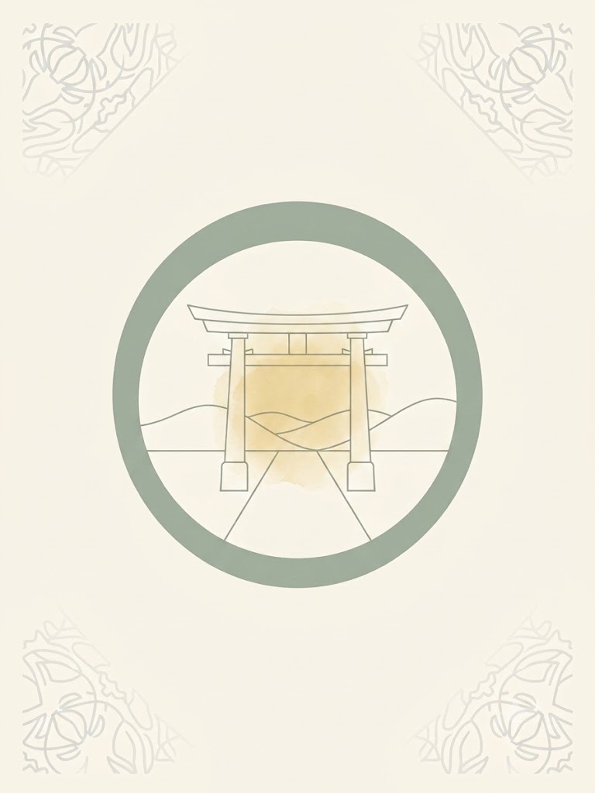

# Product Brief: VerbDeck Japanese (To-Go MVP)

## 1. Core Philosophy & Style Guide
* **The Goal:** Total oral mastery of one Japanese verb at a time. No vocabulary lists, no typing, and no textbook fluff. Just focused listening and speaking.
* **Aesthetic:** Japanese minimalism. Use a muted, neutral color palette (earthy grays, off-whites, soft sage greens), generous negative space, and sharp, modern typography. Think "Zen app"—clutter-free, calming, and deeply elegant.
* **Mobile-First & PWA:** The product is delivered as an installable **Progressive Web App (PWA)** built mobile-first. Interface, gesture areas, and layouts are designed for portrait phone screens (one-handed thumb reach) first, then scale up gracefully. The app must be installable to the home screen and functional offline (see Technical Requirements → pwa).
* **Romaji Policy:** **Strictly OFF by default** to enforce immersion in Kana and Kanji. Include a discreet, tiny toggle button in the corner to temporarily reveal Romaji subtitles only if the user gets stuck.
* **Audio Engine:** Powered entirely by the **Google Cloud Suite**. The app speaks to the user using Google Text-to-Speech (TTS) and evaluates the user's voice using Google Speech-to-Text (STT).

---

## 2. Opening Screen: The "To Go" (行く) Master Card

#### **Visual Implementation:**
The opening screen uses the pre-generated image asset `iku.jpeg` (see below) as its static background. Your developer should load `iku.jpeg` into the main card container (or as a full-screen background) and superimpose the dynamic UI text on top of it.

* **Corner UI (Dynamic Text Overlays):** * The app must overlay dynamic text in the corners where the subtle patterns of `iku.jpeg` reside:
    * **Top Left Overlay:** `VERB 01 / 20`
    * **Top Right Overlay:** `[に] 行く` (A structural reminder of the verb's mandatory directional particle).
* **Center UI (Dynamic Text Overlay):**
    * Overlay the large bold Kanji/Kana below the central torii gate circle: **行く**
    * If Romaji is toggled on, add the subtitle *Iku* underneath.
* **Button:** A single, prominent, clean button labeled **"Begin Dialogue"**.



---

## 3. The Core Engine: The Conversational Q&A Loop
Once the session begins, the `iku.jpeg` card remains the visual anchor of the screen, but the corner indexes dynamically shift to display the active conversational state. The user is guided through a 100% speech-driven interaction loop.

### The Interaction Flow:
1. **Listen:** The app automatically plays native Japanese audio generated by Google TTS asking a question (e.g., *"Ashita, doko ni ikimasu ka?"*).
2. **Read & Prompt:** The screen displays the question text in clean Japanese characters. Next to it, a tiny, minimalist icon and a keyword provide the required answer context (e.g., an icon of a temple ⛩️ and the text `お寺`).
3. **Speak:** The user holds down a central microphone icon, speaks their response out loud, and releases it.
4. **Evaluate:** The voice file is passed to the Google Speech-to-Text API configured for Japanese (`ja-JP`). 

---

## 4. Mastery Progress Tracking (The Zen Matrix)
To successfully "pass" a verb, the user must prove they understand and can accurately voice it across all 10 essential conversational forms. 

Progress is displayed at the bottom of the screen via a **10-dot horizontal grid matrix**. Each dot represents one specific grammatical state. When the user speaks an answer correctly using that targeted state, the corresponding dot fills in with a solid, calm color (like sage green). 

### The 10-Question Master Evaluation Loop for 行く (Iku):

| # | Conversational State | App Question (Audio + Text) | Visual Prompt Hint | Target Spoken Output (Strictly checked via Google STT) |
| :-: | :--- | :--- | :--- | :--- |
| **1** | Polite Present (+) | 明日、どこに行きますか？ | ⛩️ お寺 (Temple) | **お寺に行きます。** |
| **2** | Polite Present (-) | 今夜、映画に行きますか？ | ❌ いいえ (No) | **いいえ、映画に行きません。** |
| **3** | Polite Past (+) | 昨日、どこに行きましたか？ | 🗼 東京 (Tokyo) | **東京に行きました。** |
| **4** | Polite Past (-) | 京都に行きましたか？ | ❌ いいえ (No) | **いいえ、京都に行きませんでした。** |
| **5** | Casual Present (+) | 明日、どこに行く？ | 🍜 ラーメン屋 (Ramen shop) | **ラーメン屋に行く。** |
| **6** | Casual Present (-) | 今日、学校に行く？ | ❌ ううん (No, casual) | **ううん、学校に行かない。** |
| **7** | Casual Past (+) | 昨日、どこに行った？ | 🌲 公園 (Park) | **公園に行った。** |
| **8** | Casual Past (-) | デパートに行った？ | ❌ ううん (No, casual) | **ううん、デパートに行かなかった。** |
| **9** | Te-Form (Request) | 道が分かりません。 | 🗺️ (Map / Guide me) | **あそこに行ってください。** |
| **10** | Te-Form (Continuous) | 今、どこに行っていますか？ | 💼 会社 (Office) | **会社に行っています。** |

---

## 5. Technical Requirements for the Developer Agent

```json
{
  "technical_specifications": {
    "architecture": "Single-page responsive mobile-first web app (Next.js/React) or mobile framework (Flutter).",
    "pwa": {
      "type": "Installable Progressive Web App (PWA)",
      "mobile_first": "Design and build for mobile screens first; progressively enhance for tablet/desktop. All UI, touch targets, and layouts are optimized for one-handed, portrait-mode phone usage before any larger viewport is considered.",
      "manifest": "Ship a web app manifest (manifest.json) with name, short_name, start_url, display:standalone, theme_color and background_color matching the neutral/zen palette, and icon set (192px + 512px).",
      "service_worker": "Register a service worker for offline caching of the static shell (HTML, CSS, JS) and the iku.jpeg background so the app is usable offline and installable to the home screen on iOS and Android.",
      "icons": "Provide maskable and non-maskable icon variants sized 192, 256, 384, 512 for full home-screen/install support.",
      "meta_tags": "Include apple-mobile-web-app-capable, apple-mobile-web-app-status-bar-style, theme-color, and viewport meta with viewport-fit=cover for notched devices."
    },
    "image_handling": {
        "asset_name": "iku.jpeg",
        "description": "Static background for the 'To Go' verb module. Must not contain text. Text is dynamic UI overlay.",
        "deployment": "Load iku.jpeg as the card background and use absolute positioning for UI corner text and central title."
    },
    "audio_integration": {
      "output": "Google Cloud Text-to-Speech API for native app audio generation.",
      "input": "Google Cloud Speech-to-Text API running with the 'ja-JP' language profile for handling oral inputs."
    },
    "evaluation_matching_logic": {
      "type": "Fuzzy matching algorithm for user-spoken nouns, but absolute strict string matching for the target verb endings.",
      "strict_verb_targets": [
        "に行きます", 
        "に行きません", 
        "に行きました", 
        "に行きませんでした", 
        "に行く", 
        "に行かない", 
        "に行った", 
        "に行かなかった", 
        "に行ってください", 
        "に行っています"
      ]
    },
    "state_management": {
      "progress_track": "An array of 10 boolean flags mapping directly to the 10-dot UI progress grid. A session is marked 'Complete' only when all 10 indexes return True.",
      "ui_toggles": "Global boolean variable 'showRomaji' initialized to FALSE. When false, ruby/subtitle tags rendering Romaji phonetics beneath the Japanese glyphs are conditionally hidden from DOM rendering."
    }
  }
}
```
